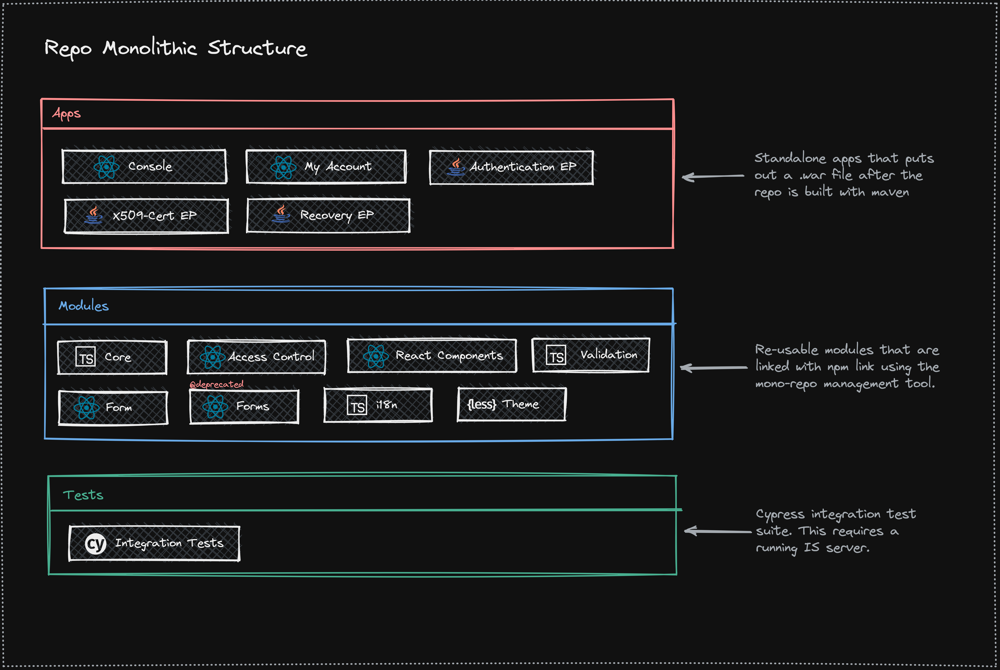
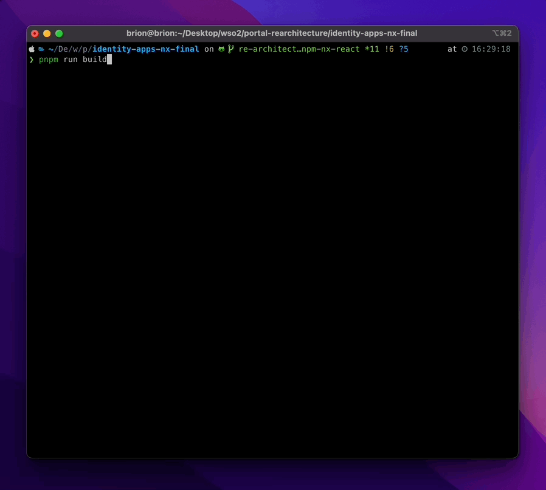

# Architecture

Follow this guide to learn how the project architecture is set-up.

## Repo Structure

We follow a monolithic structure when it comes to the structure of the repository.

The repository is setup as a **mono-repo** with the help of [NX](https://nx.dev/) mono repo management tool. And it has all the front end applications along with the shared modules. 

> 💡 A Monorepo, as the name suggests mono (single) and repo (repository of the codebase) is a single source of truth for the entire project code base.

Following is a high level diagram depicting the different components in our structure.

> ⚠️ Keep [this diagram](./assets/repo-monolithic-structure.excalidraw) up-to date when ever a component change occurs.

## Dependency Graph

Following is the [dependency graph](https://nx.dev/nx/dep-graph) generated with NX.

This shows how the different components interact with each other inside the repository.

> ⚠️ Keep this diagram up-to date when ever a component change occurs by executing `pnpx nx graph` command.

## Computational Caching

This repository leverages the [Computation Caching](https://nx.dev/using-nx/caching) provided by NX.

Following gif shows how quickly NX rebuilds from cache.

> 💡 When a certain module is changed, for an example `core`, NX will only build the specific module and the other components that depend on the `core` module. All the unrelated components will be built from cache.

## Remote Data Fetching Architecture

