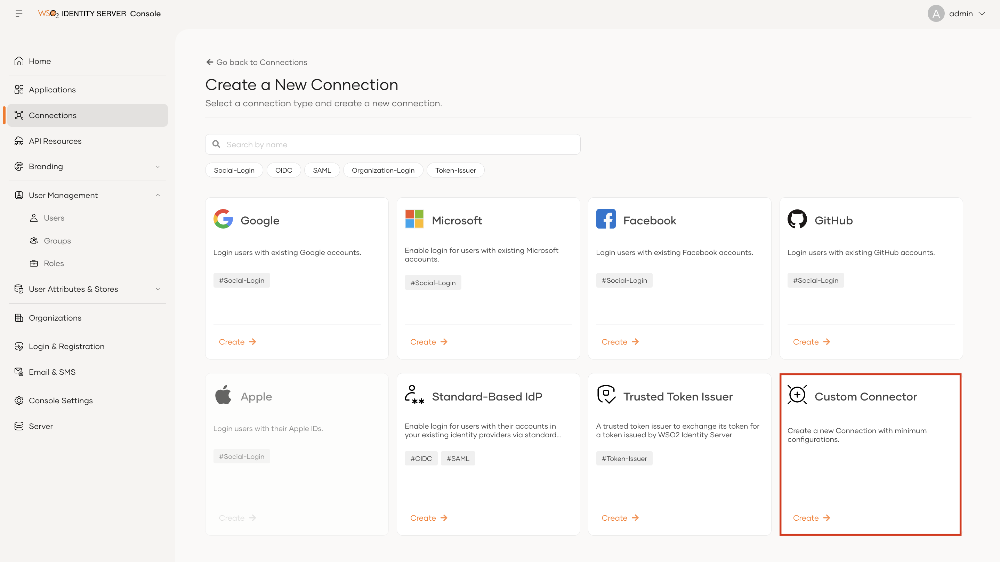
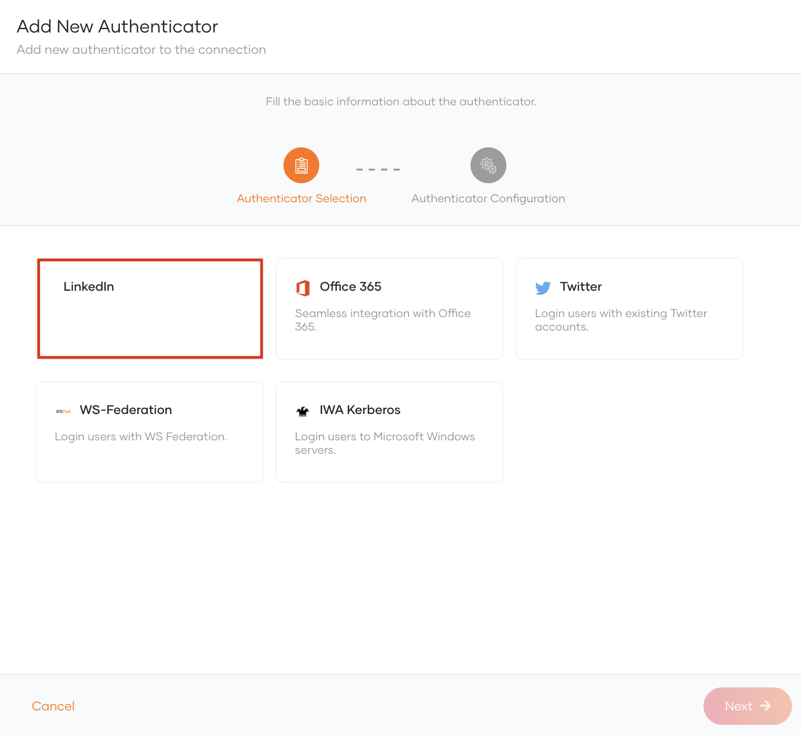
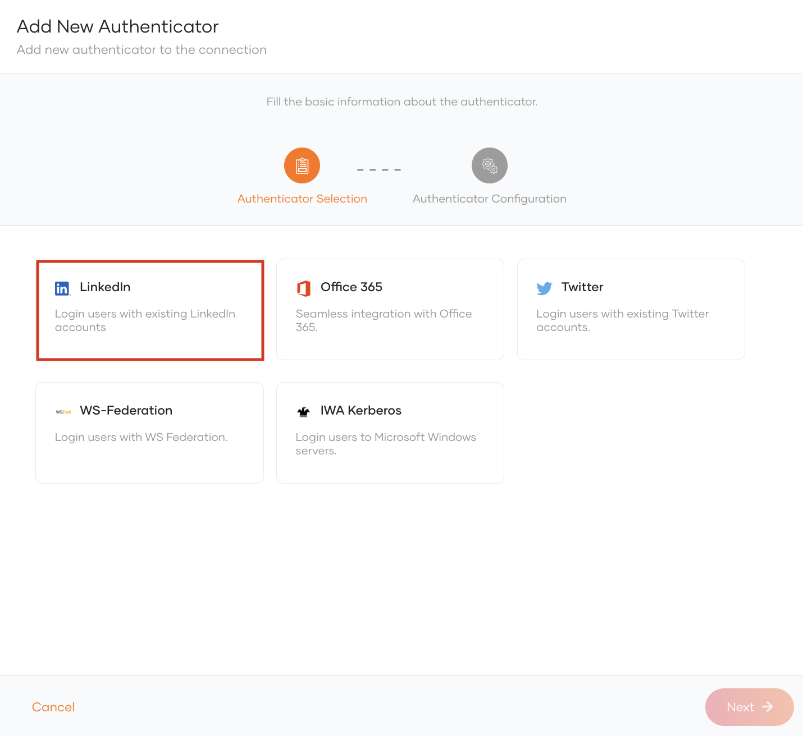

# Connectors

## Authenticators

An authenticator allows you to authenticate the user using third party authentication systems such as LinkedIn, Duo security and Foursquare.

By default Identity Server packs several of these Authenticators and they are available to be configured via the Console.

But WSO2 has a wide range of authenticators in the [connector store](https://store.wso2.com/store/assets/isconnector/list) that you can plugin in to your Identity Server instance.

Let's see how we can configure LinkedIn connector in Console.

### Steps

1. Download the [LinkedIn connector](https://store.wso2.com/store/assets/isconnector/details/3a4f9dd9-be56-4e79-a925-8d8a4ace5a8f) from WSO2 connector store.(`org.wso2.carbon.extension.identity.authenticator.linkedin.connector-x.x.x`).

2. Place the authenticator.jar file into the 
`<IS_HOME>/repository/components/dropins` directory.

3. Re-start the WSO2 Identity Server. 

> 💡 For more in formation, read through the [connector documentation](https://github.com/wso2-extensions/identity-outbound-auth-linkedIn/blob/master/docs/README.md).

4. Login to Console (https://localhost:9443/console)

5. Navigate to `Develop > Identity Providers > New Identity Provider` and create an IdP with the `Expert Mode` IdP template.

    

6. Once the IdP is created, navigate to the `Settings` tab and click on `Add Authenticator` button.

7. Select `LinkedIn` from the authenticator selection and proceed with configuration.

    

### (🦄 Optional) Add connector metadata to supplement the UI

Optionally, you can add a `display name`, `icon` and a description to the newly added connector to make the UI nicer 😉.

Add something like the following in the `<IS_HOME>/repository/conf/deployment.toml`.

> 💡 UI maps the meta data with the `authenticatorId`. This can be found by checking the `Browser Network` tab when the authenticators are loaded in the `Settings` tab.

```toml
[[console.extensions.connectors]]
authenticatorId="TGlua2VkSW4"
description="Login users with existing LinkedIn accounts"
displayName="LinkedIn"
icon="https://brand.linkedin.com/content/dam/me/business/en-us/amp/brand-site/v2/bg/LI-Bug.svg.original.svg"
```


