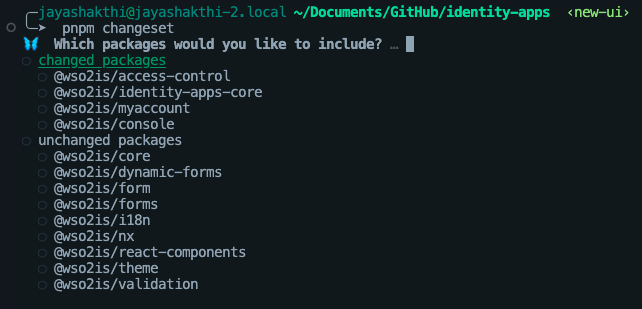
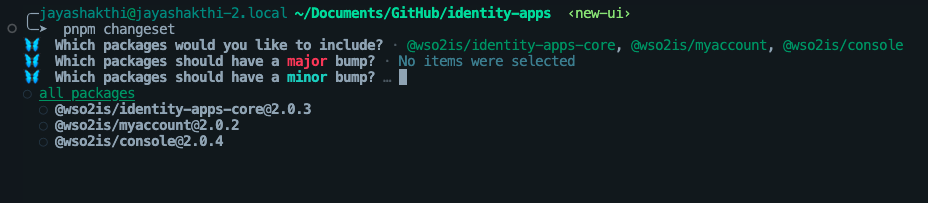
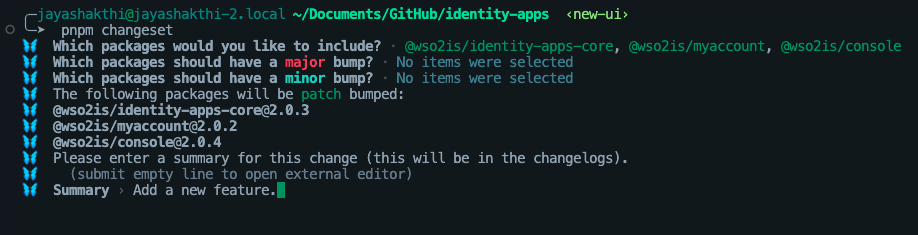
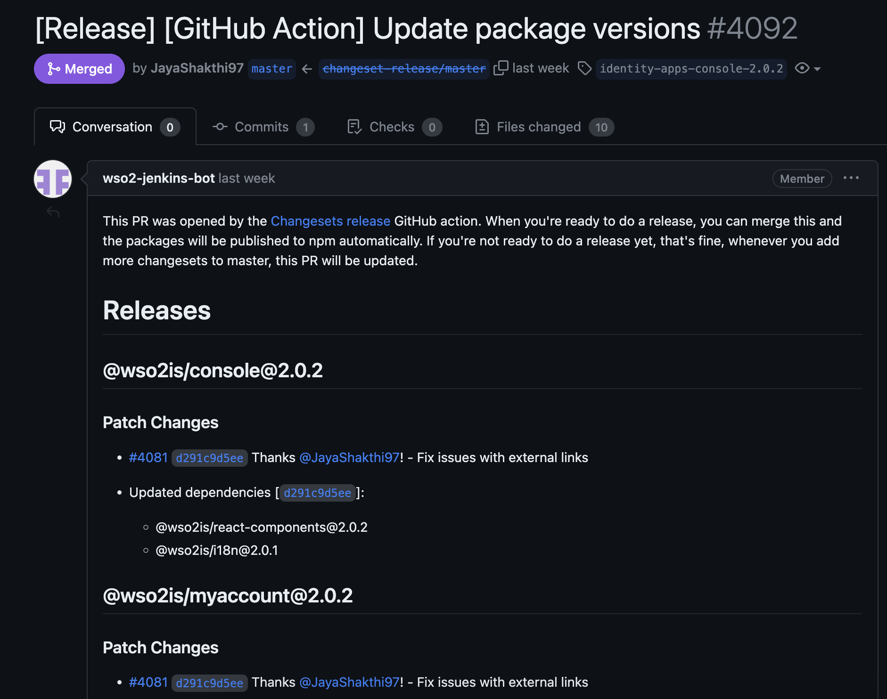

# Release

This repository uses [🦋 Changesets](https://github.com/changesets/changesets) to manage releases.

## Creating a release

1. To create a release from your PR, switch to your feature branch, and execute the following command from the identity-apps root.

> 🗒️ Note:
>
> Changeset identifies the changed packages by comparing your feature branch with the `master` branch. If these branches are not properly synced with remote, you'll some irrelevant packages listed under changed packages. Therefore, it is recommended to **rebase your feature branch on the up-to-date `master` branch before executing `pnpm changeset`**.

```bash
# from the root of the project
pnpm changeset
```

2. This will open a prompt to select the packages that have changed. Select **the changed packages and the dependents of the changed packages**, and press <kbd>Enter</kbd>.

> ℹ️ Info:
> 
> To find out the dependent packages of a changed package, open a new terminal and run `pnpm nx graph` from the `identity-apps` root. Refer to https://nx.dev/features/explore-graph#explore-the-project-graph for more details.



3. Then, it will open a prompt to select the type of change. Select the type of change and press `Enter`.

  - MAJOR version when you make incompatible API changes
  - MINOR version when you add functionality in a backward compatible manner
  - PATCH version when you make backward compatible bug fixes



4. Lastly, it will open a prompt to enter a summary of the changes. Enter a summary and press `Enter`. (Additionally, if you want to have an editor view to enter a long summary with line breaks, press `Enter` without typing anything.)

> 🗒️ Note
> 
> Please enter a meaningful summary of the changes. This will be used in the changelog.



5. Then commit the generated changeset file with the following commit message.

```bash
Add changeset 🦋
```

## Merging the autogenerated version bump PR.

1. After your PR is merged, Changesets Github Action will version the packages that have changed and create a PR with the version bump. You can find the PR in the [pull requests](https://github.com/wso2/identity-apps/pulls?q=is%3Apr+is%3Aopen+%22%5BRelease%5D+%5BGitHub+Action%5D+Update+package+versions%22) tab.

💡 Sample PR title: `[Release] [GitHub Action] Update package versions.`

2. Approve and merge the PR.
   
    > ⚠️ **Warning**
    > 
    > Do not choose `squash and merge` option to merge the version bump PR.



3. That's it! A release build will be automatically triggered after the version bump PR is merged. The changed apps and package artifacts will be released to GitHub and Nexus.
