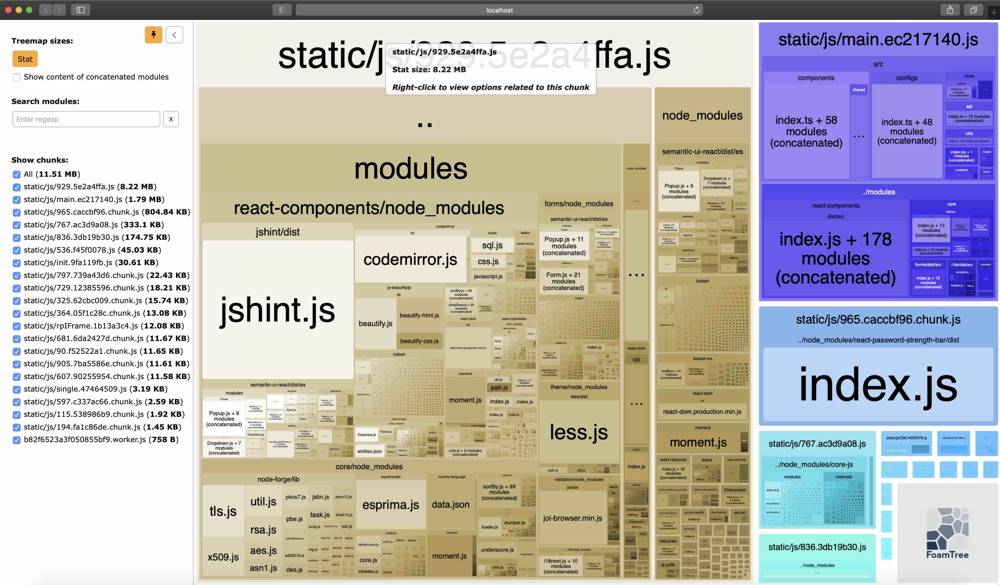

# Ensuring performance

We care a lot about maintaining the performance of our applications. Hence, it is your duty to make sure that the code you
write follows the standards and does not diminish the existing performance levels.

In-order to ensure this, please follow the following steps while making your contributions.

## Use code splitting

Webpack and React supports code splitting out of the box. Try to always leverage these features to reduce bundle size and performance.

- Read more about Webpack Code Splitting [here](https://webpack.js.org/guides/code-splitting/).
- Read more about React Code Splitting [here](https://reactjs.org/docs/code-splitting.html).

## Take advantage of tree shaking

Webpack's treeshaking is a really awesome feature to get rid of dead code. Always try to take advantage of that.

:white_check_mark: Do

```typescript
import get from "lodash-es";
```

:x: Don't

```typescript
import * as _ from "lodash-es";
```

## Don't write redundant code

Unnecessary code will bulk up the bundle without you even realizing. Always try to avoid scenarios like the following.

#### Redundant optional chain

:x: Don't

```typescript
if (user?.email && user?.email?.home) {
    ...
}
```

When the above block is transpiled, it is converted to the following.

```javascript
if ((user === null || user === void 0 ? void 0 : user.email) && ((_a = user === null || user === void 0 ? void 0 : user.email) === null || _a === void 0 ? void 0 : _a.home)) {
}
```

Notice that the first null check is redundant. It can be re-written as follows.

:white_check_mark: Do

```typescript
if (user?.email?.home) {
    ...
}
```

Following is the transpiled version of the above code block. The footprint is significantly less.

```javascript
if ((_a = user === null || user === void 0 ? void 0 : user.email) === null || _a === void 0 ? void 0 : _a.home) {
}
```

:bulb: Always remember, more characters means more bytes.

### Carefully adding new dependencies

Dependencies carry a heavy wait and contribute in a significant amount for the overall bundle size. So, when adding a new
library to the project try to answer the following questions.

Q1. Is the library absolutely required?

In some cases, you will be able to manually write the code rather than using a library. But keep in mind not to re-invent the wheel as well.

Q2. Is the library actively maintained?

Go to the NPM registry and GitHub repository of the prospective library and check for stats like downloads, stars, last published dates,
issues etc. This will give you an understanding on the state of the library.

:bulb: Never add a dependency that is not actively maintained.

Q3. Have you considered other libraries?

Do a benchmark and test other related libraries.

Q4. What is the size of the library?

You can easily check the size of the library by using an online tool like [Bundlephobia](https://bundlephobia.com/).


Q5. What are the dependencies used inside the library?

Some library developers include relatively large dependencies like [`lodash`](https://lodash.com/), [`moment`](https://momentjs.com/) etc. in their libraries as dependencies.
Adding these will result in increase bundle sizes. Check in the `package.json` for the dependencies used inside the library.

Q6. What is the footprint introduced by the newly added library?

We have added a script to analyze the bundle sizes of our react applications using [Webpack Bundle Analyzer Plugin](https://www.npmjs.com/package/webpack-bundle-analyzer).

Use the following command to examine the footprint introduced by the prospective library.

#### Analyze for Console

:bulb: The analyzer will open in http://localhost:8889

```shell
npx lerna run build:analyze --scope @wso2is/console
```

#### Analyze for My Account

:bulb: The analyzer will open in http://localhost:8888

```shell
npx lerna run build:analyze --scope @wso2is/myaccount
```

Once you execute the above command, the resulting view will look something like the following.



### Optimize static assets

When adding new assets, always check the existing once in the theme and only proceed if the desired asset is not available.

#### Adding Images

When adding images, always try to add SVGs which are optimized for web.

#### Prepend unused arguments with `_`

There might be times when you have to leave an argument unused in a function, especially when writing extension configs. This will prompt the linter to throw a warning.
To avoid this, always prepend the unused argument with `_`.

```TypeScript
const printAge(_name: string, age: number){
    console.log(age);
}
```
