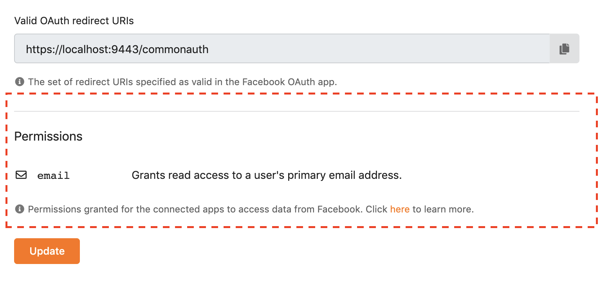

# Styling

## Forms
Always use the new [@wso2is/form](../../modules/form) module when developing forms.

Read the documentation [here](../FORMS.md).

### Sectioned Form

When styling the forms, avoid using any ad-hoc Headings, Dividers etc.
If you wish to write a form with sub-sections, use the [FormSection](../../modules/react-components/src/components/forms/form-section.tsx) component.
It will add a divider and a Heading with a constant emphasis level.

#### Usage

```tsx
<FormSection heading=“Permissions”>
    <Field.Input
        ariaLabel="scopes"
        inputType="text"
        name="scopes"
        …
    />
    <Field.Input
        ariaLabel="user data"
        inputType="text"
        name="userData"
        …
    />
<FormSection>
```

#### Output



[react-conditional-rendering]: https://reactjs.org/docs/conditional-rendering.html
